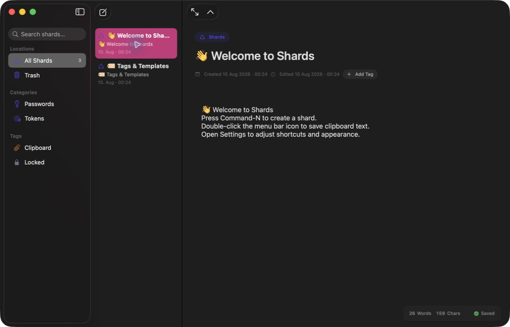
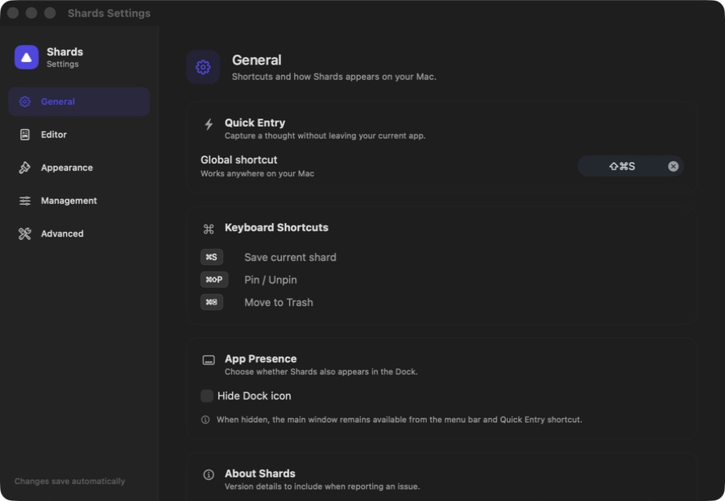

<p align="center">
  
</p>

<h1 align="center">Shards</h1>

<p align="center">A local macOS vault for quick notes</p>

<p align="center">
  
  
  
  
</p>



Shards turns quick notes, clipboard text, and reusable templates into searchable pieces of information—without an account or cloud service.

## highlights

- Spotlight-style Quick Entry with `Command–Shift–S`; use `Tab` to cycle modes and `Escape` to close it.
- Local clipboard capture from the menu bar.
- Search in the app or macOS Spotlight, native multi-selection, drag-to-tag, pinning, Trash, and restore.
- Extensible templates for structured information, including sensitive fields that stay concealed until revealed.
- Optional Smart mode with an editable preview; it does not read historical Vault content.
- Global or per-Shard password protection, JSON/CSV import and export.
- System, Light, and Dark appearances; manual signed updates through Sparkle.
- Update-safety backups and a diagnostics page for local troubleshooting.



## privacy

- Data stays in `~/Library/Application Support/Shards/Shards.store`.
- Ordinary Shards are plain text or JSON unless protection is enabled.
- Protected payloads use CryptoKit AES-GCM; titles and metadata may remain unencrypted.
- Smart mode sends only the current draft and template schema to your configured endpoint.
- The optional LLM token is stored in local preferences, not Keychain.
- Safety backups live beside the Vault and may contain ordinary Shards as readable JSON.

Shards is a personal capture tool, not a dedicated password manager. Exported files should be handled according to the sensitivity of their contents.

## build

Requires macOS 15+, Xcode 16+, and Swift 6. Open `Shards.xcodeproj`, select the `Shards` scheme, and run.

```bash
xcodebuild -project Shards.xcodeproj -scheme Shards \
  -destination 'platform=macOS,arch=arm64' \
  SWIFT_STRICT_CONCURRENCY=complete test
```

Create a local package with `zsh scripts/package-release.sh`. Prepare a Sparkle-signed GitHub update with `zsh scripts/prepare-sparkle-release.sh`. Developer ID signing and notarization are still required to avoid Gatekeeper warnings on other Macs; see [docs/release.md](docs/release.md).

The bundle identifier is `com.tangxiaoyi.Shards`. Version 1.0 migrated known preferences from the former `com.yourdomain.Shards` domain.

## credits

唐晓翼 tangxiaoyi97<br>
gpt5.6 sol

[MIT](LICENSE) © 2026 唐晓翼 (Tangxiaoyi97). See [Third-Party Notices](THIRD_PARTY_NOTICES.md) for bundled dependencies.
